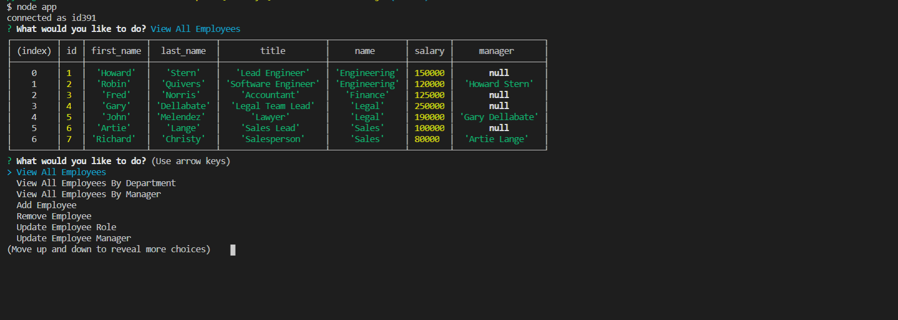

# Employee-Tracker

A CLI Node.js app that allows a user to essentially control a Content Management System of a company. The user has the ability to view all of the employees by department, job and even manager. Employees, positions and departments can be created and deleted as well. Extra features involving managers will be available soon. 

## Running App:

